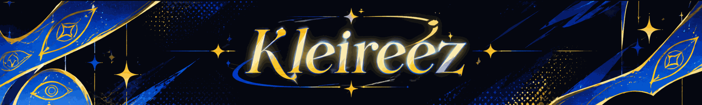
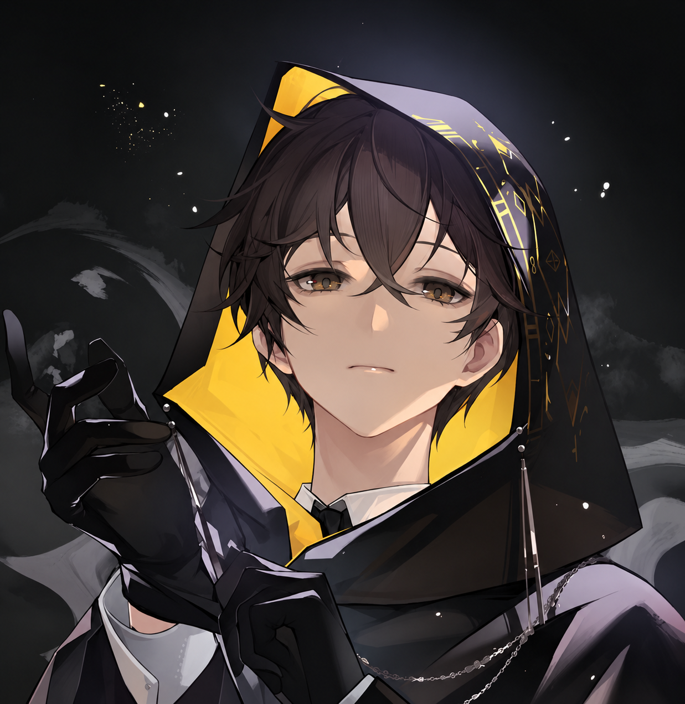

  

 

#### Introduction

- Name: **Egi Frizi Manda**

- From: **Pekanbaru, Riau, Indonesia**

- Currently: studying **Informatic Engineering** at **Politeknik Caltex Riau**

- Off the clock: reading, gaming to recover my spirituality, then studying to keep myself from losing control.

- Focus: **Web Development**, **Laravel**, **PHP** & **Java**

- Currently learning: **Laravel**, building small projects to sharpen my skills

- Tools I use: **VS Code**, **Git** & **Linux**

- Fun fact: I write code to build things, and game to rebuild myself

 

#### Most Languages & Skills

&emsp;&emsp;&emsp;&emsp;

 

#### Song

 
 
“Knowledge can change one’s destiny, and diligence will result in glory.” – Klein
  

  

  
  
  

#####

<picture>
  <source
    media="(prefers-color-scheme: dark)"
    srcset="https://www.adamalston.com/observatory.svg"
  />
  <source
    media="(prefers-color-scheme: light)"
    srcset="https://www.adamalston.com/observatory.svg?theme=light"
  />
  
</picture>

<picture data-importer="pacman">
  <source media="(prefers-color-scheme: dark)" srcset="https://raw.githubusercontent.com/Kleireez/Kleireez/pacman-output/pacman-contribution-graph-dark.svg?game=pacman">
  <source media="(prefers-color-scheme: light)" srcset="https://raw.githubusercontent.com/Kleireez/Kleireez/pacman-output/pacman-contribution-graph.svg?game=pacman">
  
</picture>

